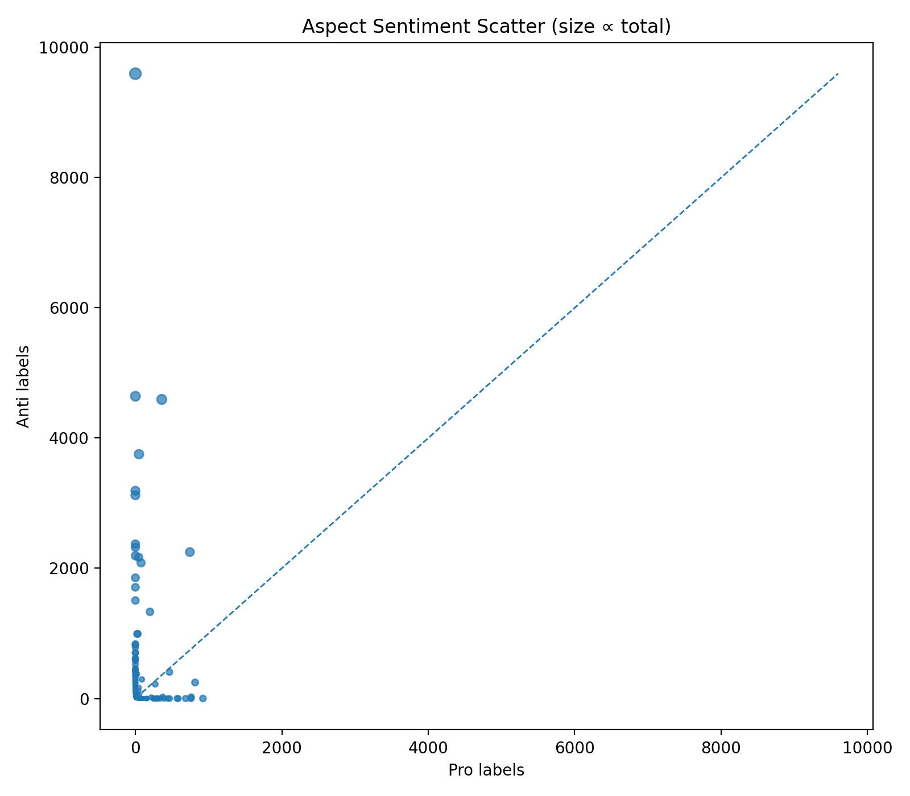
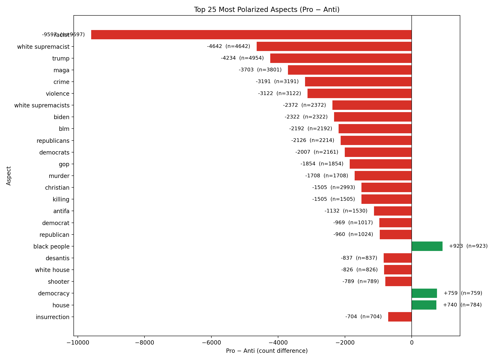
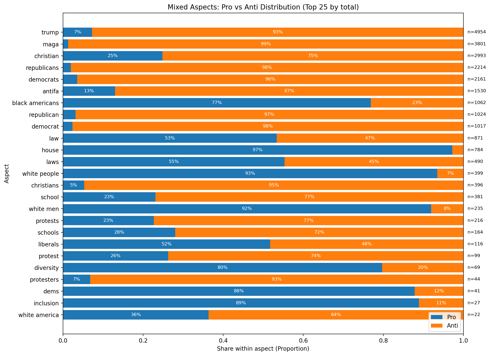

# Ark Stance Detection

Small research project for stance detection and aspect-masked ABSA experiments.

## Performance summary

Below are selected performance plots summarizing model comparisons (AUC / accuracy) from the project. These give a quick visual overview of results.

<!-- Performance plots -->
<p align="center">
	
	
</p>

<p align="center">
	
	
</p>

## Dataset statistics

Key dataset visualizations are shown below to illustrate class distribution, polarization and aspect composition.

<!-- Dataset plots -->
<p align="center">
	
	
</p>

<p align="center">
	
</p>


## Repo layout

- `Dataset/` — data files (csv, json, etc.).
- `Narratives/` — narrative files and tweet id lists.
- `dataset_analysis.py` — small script to inspect the dataset and generate `Dataset/unique_words.txt`.
- `dataset.py` — PyTorch Dataset wrapper `maskedABSA_Dataset` for the weakly labeled race dataset.
- `Ark_Aspect_Masking/` — model code and helpers for image/text models (if present).

## Quick start

1. Install minimal dependencies (example):

```bash
pip install pandas torch timm transformers
```

2. Inspect dataset and generate the list of unique words:

```bash
python3 dataset_analysis.py
```

This will print a sample and write `Dataset/unique_words.txt` (now stored as a Python list literal).

3. Use the PyTorch dataset in `dataset.py`:

```python
from dataset import maskedABSA_Dataset
train_ds = maskedABSA_Dataset("Dataset/weakly_labeled_race_dataset.csv", split='train')
```

`maskedABSA_Dataset` supports optional `split` (`'train'|'val'|'test'`) and `annotation_percent` to subsample.

## Notes

- `Dataset/unique_words.txt` is written as a Python list literal by `dataset_analysis.py`.
- Large binary/model files should be tracked with Git LFS if you plan to push them to a remote.

## License

Add your preferred license here.

## Run commands (examples)

The project includes a `run_command.txt` file with example commands used to run experiments. Below are the same commands with short explanations so you can reproduce common runs.

1) Resume example (image backbone resume run)

```bash
python -u main_ark.py \
	--data_set MIMIC --model convnext_base --individual --pretrain_epochs 5 --batch_size 32 --test_epoch 1 --anno_percent 100 \
	--exp_name ark_convnext_ImageNet1k_MIMIC_test \
	--pretrained_weights /path/to/Models/convnext_base_ImageNet_1k/Ark_MIMIC/ark_convnext_ImageNet1k_MIMIC_test/Ark_MIMIC.pth.tar \
	> Logs/ark_convnext_ImageNet1k_MIMIC_test.log 2>&1
```

What it does:
- Runs `main_ark.py` on the `MIMIC` dataset using the `convnext_base` backbone.
- `--individual` indicates an individual training configuration per the project's CLI.
- `--pretrained_weights` resumes from a checkpoint; update the path to your local checkpoint.
- Output (stdout/stderr) is redirected to `Logs/... .log`.

2) MaskedABSA with stance_bert (dev run)

```bash
python3 -u main_ark.py --data_set MaskedABSA --model stance_bert --exp_name ark_stancebert_MaskedABSA_dev > Logs/ark_stancebert_MaskedABSA_dev.log 2>&1
```

What it does:
- Runs the `stance_bert` model on the `MaskedABSA` dataset and logs output to `Logs/ark_stancebert_MaskedABSA_dev.log`.

3) Unmasked ABSA run (example)

```bash
python3 -u main_ark.py --data_set unMaskedABSA_race --model stance_bert --unmasked
```

What it does:
- Runs the stance_bert model on an unmasked ABSA race dataset. The `--unmasked` flag toggles the dataset variant.

4) MaskedABSA_race baseline training

```bash
python3 -u main_ark.py --data_set MaskedABSA_race --individual --exp_name MaskedABSA_race_individual_baseline --pretrain_epochs 50 --test_epoch 1
```

What it does:
- Train a baseline model on `MaskedABSA_race` for 50 pretrain epochs and run evaluation on `--test_epoch 1`.

5) MaskedABSA_politic baseline training

```bash
python3 -u main_ark.py --data_set MaskedABSA_politic --individual --exp_name MaskedABSA_politic_individual_baseline --pretrain_epochs 50 --test_epoch 1
```

What it does:
- Same as above but for the `MaskedABSA_politic` dataset.

6) Joint training over two datasets

```bash
python3 -u main_ark.py --data_set MaskedABSA_race --data_set MaskedABSA_politic --exp_name Joint_Training --pretrain_epochs 50 --test_epoch 1
```

What it does:
- Runs joint training across both `MaskedABSA_race` and `MaskedABSA_politic` datasets.

7) Testing / evaluation with a pretrained checkpoint

```bash
python3 -u main_ark.py --data_set MaskedABSA_race --data_set MaskedABSA_politic --exp_name Model_Testing --pretrain_epochs 0 --test_epoch 1 --pretrained_weights /path/to/Models/stance_bert_masked_Random/Ark_MaskedABSA_race_MaskedABSA_politic.pth.tar
```

What it does:
- Loads a pretrained checkpoint and runs evaluation (`--pretrain_epochs 0` means no training, `--test_epoch 1` runs the test pass).
- Update `--pretrained_weights` to the correct local path for your checkpoint.

Notes
- Replace `/path/to/...` with the actual paths on your machine.
- Redirecting output to `Logs/*.log` (`> file.log 2>&1`) is optional but useful for long runs.
- If you run experiments on GPU servers, ensure CUDA_VISIBLE_DEVICES or other environment variables are set as needed.

